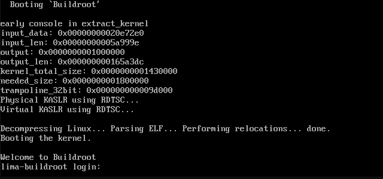

# bean

Creating a boot ISO with containerd/buildkitd, for lima.


Lima:

Lima launches Linux virtual machines, using [QEMU](https://www.qemu.org/).

> An image has to satisfy the following requirements:
>
> - systemd or OpenRC
> - cloud-init
> - The following binaries to be preinstalled:
>   - `sudo`
>   - `sshfs`
>   - `newuidmap` and `newgidmap` (shadow)

Format:

- `disk.img`
  - kernel (bzImage)
  - rootfs (rootfs.ext4)
- `cidata.iso`
  - `user-data` (cloud-init)
  - generated by: `limactl`

Bootloader:

- UEFI (instead of BIOS)
- GRUB

Architecture:

- amd64 (`x86_64`)
- arm64 (`aarch64`)

Software:

- `sshd`
- `containerd`
- `buildkitd`
- `nerdctl`

Docker:

`nerdctl` is a Docker-compatible CLI for contai**nerd**.  🤓

nerdctl is a non-core sub-project of CNCF's [containerd](https://containerd.io/).

```console
# nerdctl build -t foo .
# nerdctl run -it --rm foo
```

Toolbox:

The regular image does **not** have a package manager,
but it is possible to install a toolbox container.

The default `toolbox` uses the `alpine` distribution.
That makes it possible to install `apk` packages.

`2.7M	/var/lib/toolbox/alpine_latest.tar`

Based on [CoreOS Toolbox](https://github.com/coreos/toolbox), but using nerdctl.

---

qemu



pstree

```text
init-+-buildkitd---5*[{buildkitd}]
     |-containerd---7*[{containerd}]
     |-klogd
     |-sshd
     |-supervise-daemo---sh---pstree
     |-syslogd
     `-udhcpc
```

The download is around 100 MB, with all batteries included.

```text
98M	output/disk.img.gz
```

See <https://github.com/afbjorklund/buildroot4containers>

---

Written by Anders F Björklund <https://github.com/afbjorklund>

Green Beans image credit: Designed by macrovector / [Freepik](http://www.freepik.com)
